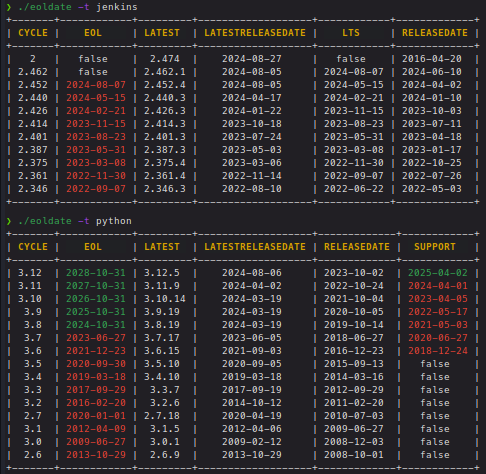

# eoldate

[](https://goreportcard.com/report/github.com/mr-pmillz/eoldate)


[](https://twitter.com/intent/tweet?text=Wow:&url=https%3A%2F%2Fgithub.com%2Fmr-pmillz%2Feoldate)
[](https://github.com/mr-pmillz/eoldate/actions/workflows/ci.yml)

## About

An End of Life Date API SDK written in Go

This is a wrapper around the endoflife.date API
[Read the Docs](https://endoflife.date/docs/api)

## Installation

To install, run the following command or download a pre-compiled binary from the [releases page](https://github.com/mr-pmillz/eoldate/releases)

```shell
go install -v github.com/mr-pmillz/eoldate/cmd/eoldate@latest
```

## Usage

```shell
Usage of ./eoldate:
  -getall
        get all results from all technologies
  -o string
        output directory to save results to
  -t string
        technology/software name to lookup
  -version
        show version and exit
```

## Example Output



## eoldate as a library

Integrate eoldate with other go programs

```go
package main

import (
	"fmt"
	"github.com/mr-pmillz/eoldate"
	"log"
	"time"
)

func main() {
	client := eoldate.NewClient()
	softwareName := "php"
	phpVersion := "7.4"
	isSupported, latestVersion, product, err := client.IsSupportedSoftwareVersion(softwareName, phpVersion)
	if err != nil {
		log.Fatal(err)
	}

	latestVersionInfo := fmt.Sprintf("The latest version of %s on %v was %s.", softwareName, time.Now().Format("01-02-2006"), latestVersion)

	endDate := product.GetEndDate()
	if isSupported {
		fmt.Printf("%s %s is Supported. %s\n", softwareName, phpVersion, latestVersionInfo)

		if endDate != nil {
			years, months, days := eoldate.CalculateTimeDifference(*endDate)
			fmt.Printf("Support ends in %d years, %d months, and %d days (%s)\n", years, months, days, endDate.Format("01-02-2006"))
		}
	} else {
		fmt.Printf("%s %s is no longer Supported. %s\n", softwareName, phpVersion, latestVersionInfo)

		if endDate != nil {
			years, months, days := eoldate.CalculateTimeDifference(*endDate)
			fmt.Printf("Support ended %d years, %d months, and %d days ago (%s)\n", years, months, days, endDate.Format("01-02-2006"))
		}
	}
}
```
